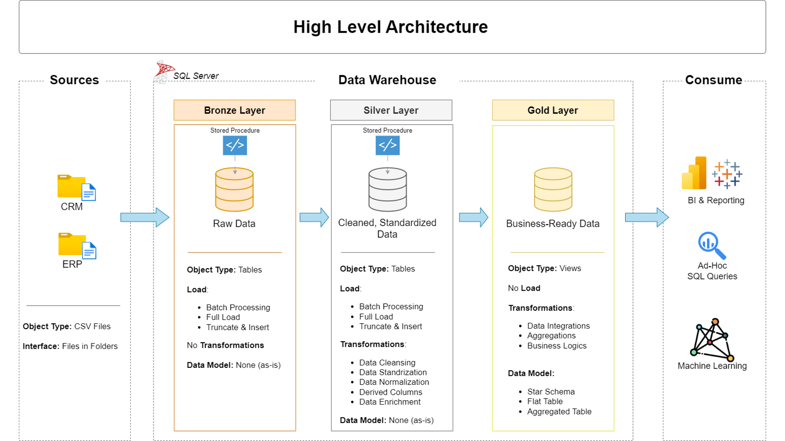

# 🏦 Data Warehouse & Analytics Project

Welcome to the **Data Warehouse & Analytics Project** 🚀  
This repository presents a **modern data warehousing solution** designed and implemented to demonstrate practical skills in **data engineering, data modeling, and analytics**.

The project focuses on building a structured data warehouse using **Medallion Architecture (Bronze, Silver, Gold)** and enabling **SQL-based analytical insights** for business decision-making.

---

## 🏗️ Data Architecture

The system follows the **Medallion Architecture** pattern, separating data into three logical layers for scalability, data quality, and analytics readiness.



### Architecture Layers
1. **Bronze Layer**  
   - Stores raw data ingested directly from source systems (CSV files).
   - Data is loaded into SQL Server without transformation.

2. **Silver Layer**  
   - Performs data cleansing, standardization, and normalization.
   - Ensures data quality and consistency for downstream use.

3. **Gold Layer**  
   - Contains business-ready data modeled using a **star schema**.
   - Optimized for analytical queries, reporting, and dashboards.

---

## 📖 Project Overview

This project covers the full lifecycle of a data warehouse:

1. **Data Architecture Design**  
   - Designing a modern data warehouse using Medallion Architecture.

2. **ETL Pipeline Development**  
   - Extracting data from source systems.
   - Transforming and cleaning data.
   - Loading structured data into analytical layers.

3. **Data Modeling**  
   - Designing fact and dimension tables.
   - Applying star schema modeling for analytics.

4. **Analytics & Reporting**  
   - Writing SQL queries to generate business insights.
   - Supporting analytical use cases such as sales and customer analysis.

🎯 This project demonstrates hands-on skills in:
- Data Engineering  
- SQL Development  
- Data Warehousing  
- ETL Pipeline Design  
- Data Modeling  
- Data Analytics  

---

## 🛠️ Technologies & Tools

### Core Technologies
- **SQL Server (Express Edition)**
- **SQL Server Management Studio (SSMS)**
- **SQL**

### Design & Documentation
- **Draw.io** – Architecture, ETL flow, and data models
- **Git & GitHub** – Version control and project management

---

## 🚀 Project Requirements

### Data Engineering Objective
Develop a modern data warehouse that consolidates sales data from multiple source systems to support analytical reporting and business insights.

### Specifications
- **Data Sources**:  
  - ERP and CRM systems (CSV files)
- **Data Quality**:  
  - Handle missing values, duplicates, and inconsistent formats
- **Integration**:  
  - Merge multiple sources into a unified analytical data model
- **Scope**:  
  - Focus on the latest available data (no historical tracking required)
- **Documentation**:  
  - Provide clear documentation for architecture, data models, and pipelines

---

## 📊 Analytics & Reporting

### Analytics Objective
Develop SQL-based analytical queries to answer key business questions related to:
- **Customer Behavior**
- **Product Performance**
- **Sales Trends**

These insights support data-driven decision-making and reporting use cases.

Detailed requirements can be found in:  
📄 `docs/requirements.md`

---

## 📂 Repository Structure
```bash
data-warehouse-project/
│
├── datasets/                           # Raw source datasets (ERP and CRM)
│
├── docs/                               # Architecture and documentation
│   ├── etl.drawio                      # ETL flow diagrams
│   ├── data_architecture.drawio        # Data architecture design
│   ├── data_catalog.md                 # Dataset metadata and descriptions
│   ├── data_flow.drawio                # Data flow diagrams
│   ├── data_models.drawio              # Star schema data models
│   ├── naming-conventions.md           # Naming standards
│
├── scripts/                            # SQL scripts
│   ├── bronze/                         # Raw data ingestion
│   ├── silver/                         # Data cleansing & transformation
│   ├── gold/                           # Analytical models
│
├── tests/                              # Data quality and validation scripts
│
├── README.md                           # Project overview
├── LICENSE                             # License information
├── .gitignore                          # Git ignore rules
└── requirements.txt                    # Project requirements
